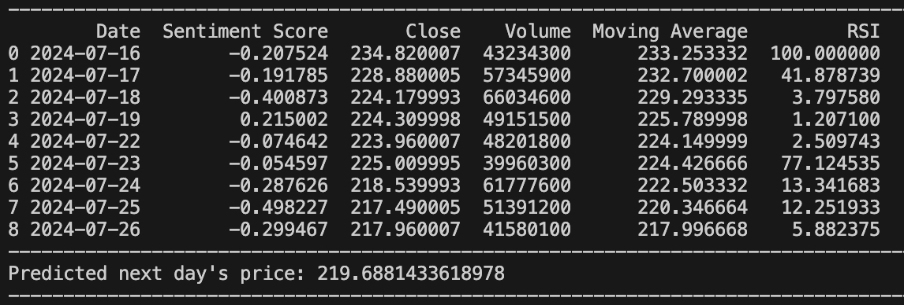

# How to use

On command line - python3 main1.py {ticker}

React app:

> start npm

> uvicorn main:app --reload

Go to http://localhost:3000

# Project Description

## Overview

The Stock Price Prediction System is a Python-based tool designed to forecast the next day's stock price using historical market data and sentiment analysis. This project leverages machine learning techniques, including Long Short-Term Memory (LSTM) networks, to analyze and predict stock price movements based on features such as moving averages, relative strength index (RSI), and sentiment scores derived from news articles.

## Features

Historical Market Data Collection: Retrieves 30 days of stock data including closing prices and trading volumes.
Sentiment Analysis: Incorporates sentiment scores from news articles to enrich the prediction model.
Feature Engineering: Computes moving averages and RSI as additional features for the model.
LSTM-Based Forecasting: Utilizes LSTM layers to capture temporal dependencies and predict future stock prices.
Data Normalization: Scales features to ensure balanced contribution to the model.
Prediction Output: Provides the forecasted next day's stock price along with detailed feature data.
Components

1. Stock Data Analysis
File: stock.py

This file defines the Stock class, which handles:

Data Collection: Fetches historical stock data and sentiment scores.
Feature Engineering: Calculates moving averages and RSI.
Prediction: Uses an LSTM model to predict the next day's stock price.

2. Web Scraping and Sentiment Analysis
File: yahoo.py

This file contains functions for:

Web Scraping: Uses Selenium and BeautifulSoup to scrape news articles from Yahoo Finance.
Sentiment Analysis: Applies the DistilBERT base uncased finetuned SST-2 sentiment analysis tool to extract sentiment scores from news titles.
